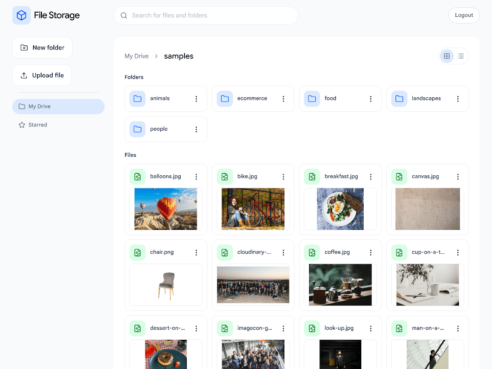

# File Storage

Cloud drive for storing files built with Node.js, Express, PostgreSQL, Prisma ORM, Typescript, React and Tailwind CSS. Files are stored on Cloudinary's cloud storage.

[Live Demo](https://file-storage-mariusz-ciaston.koyeb.app/) :point_left:   

|  |
| ------------------------------------- |
